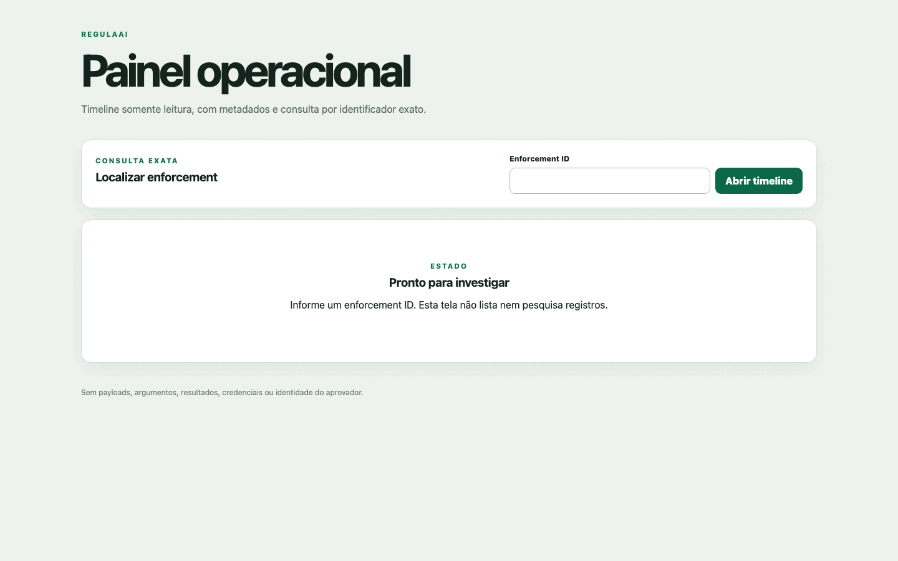
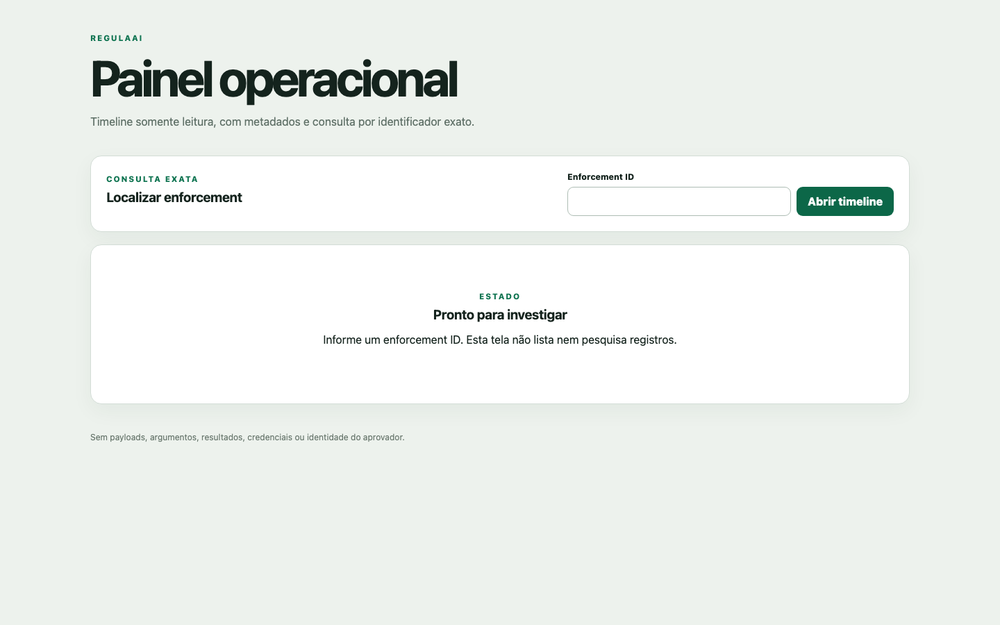
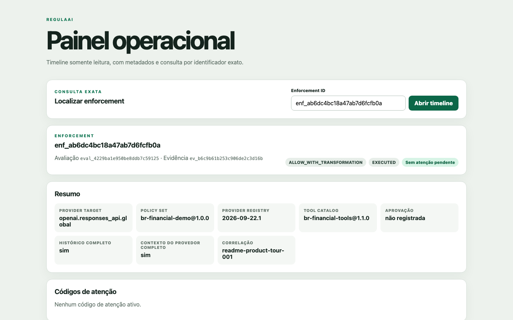
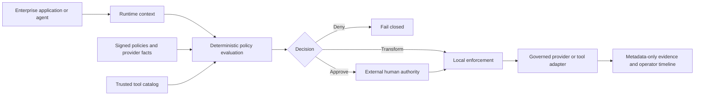

# RegulaAI — Regulated AI Control Plane

[](https://github.com/brunovicco/regulated-ai-control-plane/actions/workflows/quality.yml)
[](https://github.com/brunovicco/regulated-ai-control-plane/releases)
[](https://www.python.org/)
[](LICENSE)

> Govern data, provider choice and tool authority before an AI operation crosses a trust boundary.

[Português (Brasil)](README.pt-BR.md) · [Documentation](docs/README.md) · [Guided demo](docs/DEMO.md) · [Pilot release](docs/PILOT_RELEASE.md)

RegulaAI is a technical control plane for enterprise AI. It evaluates organization-approved
policy, applies enforceable obligations, constrains provider and tool execution, and records
metadata-only evidence—without asking a model to decide its own permissions.

The initial product focus is Brazilian financial services, including privacy, international data
transfer, provider capability and agent-authority concerns.

## Product tour



The tour shows a real local execution with fixed synthetic data and the network-silent mock
provider. RegulaAI tokenizes the identifier before execution, reaches
`ALLOW_WITH_TRANSFORMATION` / `EXECUTED`, and exposes only metadata, control context and digests in
the operator timeline.

<details>
<summary>Static screenshots</summary>

<p align="center">
  
  
</p>

</details>

## Why RegulaAI

Enterprise AI needs more than model access. A production request may need to answer:

- Is this data allowed to leave the local trust boundary?
- Does the selected provider configuration satisfy the required controls?
- Which fields must be removed, masked, tokenized or pseudonymized first?
- Can the model propose this tool, and who may authorize the exact action?
- What evidence can be retained without storing prompts, responses or personal data?

RegulaAI turns those questions into deterministic, reproducible decisions and enforcement steps.

## What it provides

| Capability | Outcome |
| --- | --- |
| Deterministic policy evaluation | `ALLOW`, `ALLOW_WITH_TRANSFORMATION`, `REQUIRE_APPROVAL` or `DENY` |
| Local data enforcement | Remove, mask, tokenize or pseudonymize fields before external I/O |
| Provider capability registry | Resolve reviewed provider/service/region facts and fail closed on stale or unknown requirements |
| Human authority boundaries | Bind approvals to exact decision and action digests, with one-time consumption |
| Trusted tool execution | Treat model tool calls as proposals; validate exact arguments and closed output schemas |
| Safe result handling | Minimize untrusted tool output and never persist raw or safe result content |
| Operational evidence | Store versioned identifiers, reason codes, states and digests—not sensitive content |
| Release governance | Verify signed control packs, review impact, authorize promotion and preserve evidence custody |

## How it works



RegulaAI sits above AI providers and enterprise systems, and below applications or agents. Policy
and authority remain outside the model. The default runtime is network-silent; live integrations
must be explicitly selected and configured.

## Try it locally

Requirements: Python 3.13+ and [`uv`](https://docs.astral.sh/uv/).

```bash
uv sync --frozen --all-groups --extra observability
uv run uvicorn regulated_ai.entrypoints.api:app --host 127.0.0.1 --port 8000
```

In another terminal:

```bash
curl http://127.0.0.1:8000/health
curl http://127.0.0.1:8000/v1/providers
```

Continue with the [guided synthetic demo](docs/DEMO.md) to evaluate a financial-services request,
apply local transformations, inspect metadata-only evidence and explore the operator timeline. The
default demo makes no provider or enterprise-system network call and needs no cloud credentials.

## Runtime surface

| Endpoint | Purpose |
| --- | --- |
| `POST /v1/evaluations` | Evaluate policy and return a deterministic decision and obligations |
| `POST /v1/enforcements` | Apply local controls and cross the configured provider boundary when authorized |
| `GET /v1/evidence/{evidence_id}` | Read metadata-only decision evidence |
| `GET /v1/enforcements/{id}` | Read current enforcement state and receipts |
| `POST /v1/enforcements/{id}/tool-actions` | Validate and execute one exact, separately approved tool action |
| `GET /v1/tool-actions/{id}` | Read metadata-only action state and digests |
| `POST /v1/tool-actions/{id}/reconciliation` | Record an authenticated terminal outcome without reexecution |
| `GET /v1/operator/enforcements/{id}/timeline` | Inspect the ordered control lifecycle for one enforcement |
| `GET /operator?enforcement_id={id}` | Open the server-rendered operator view for one exact ID |
| `GET /v1/providers` | Inspect the verified control-pack and capability metadata |
| `GET /health` | Check service health |

See the [API contract](docs/API_CONTRACT.md) for schemas, status transitions and privacy rules.

## Trust model

The design is anchored by a few non-negotiable rules:

1. Regulations do not execute code; reviewed control objectives become organization policy.
2. A model never grants itself authority.
3. Provider claims become usable capabilities only after curated, versioned review.
4. Required controls fail closed when evidence is missing, stale or invalid.
5. Provider fallback cannot weaken the original policy decision.
6. Sensitive input is never an evidence or observability payload.
7. Material decisions are reproducible from versioned inputs and cryptographic digests.

Read the [threat model](docs/THREAT_MODEL.md), [privacy model](docs/PRIVACY.md) and
[architecture](docs/ARCHITECTURE.md) for the complete boundary definitions.

## Controlled pilot

The current release is [`v0.1.0rc1`](https://github.com/brunovicco/regulated-ai-control-plane/releases/tag/v0.1.0rc1),
a bounded, non-production pilot.

Supported:

- single tenant, single replica and a dedicated SQLite evidence database;
- network-silent mock execution by default;
- one fixed-synthetic provider composition through a reviewed gateway workload;
- one identity-bound, read-only enterprise sandbox connector;
- synthetic data, sandbox systems and externally managed secrets only.

Not supported:

- production traffic or production personal data;
- multi-replica or distributed persistence;
- SaaS tenant isolation or global operator discovery;
- state-changing enterprise connectors;
- product-grade OIDC/RBAC or a claim of regulatory certification.

The [pilot release profile](docs/PILOT_RELEASE.md) defines verification, acceptance and rollout
boundaries.

The current source also includes the next production foundation: PostgreSQL persistence, versioned
migrations and concurrency-safe multi-replica claims. It does not expand the tagged pilot's scope
until deployment-owned TLS, backup/restore, SLO and acceptance evidence are complete.

## Repository map

```text
src/regulated_ai/
├── domain/        # policies, decisions, obligations and evidence types
├── application/   # evaluation, enforcement, tool authority and release use cases
├── adapters/      # YAML, SQLite/PostgreSQL, signatures, gateway, tools and observability
├── entrypoints/   # FastAPI, operator UI, logging and pilot command
└── resources/     # packaged signed demo control pack

docs/              # product, architecture, security and operating guides
examples/          # synthetic policies, provider facts, scenarios and tools
governance/        # technical-control and risk-management evidence
deploy/            # non-applied Kubernetes/OpenShift references
tests/             # unit, contract and end-to-end coverage
```

## Documentation

Use the [documentation hub](docs/README.md) to choose a path for product evaluation, architecture,
security review, integration or operation. Chronological engineering records live separately in
the [roadmap](docs/MVP_ROADMAP.md), [implementation plan](docs/IMPLEMENTATION_PLAN.md),
[ADRs](docs/adr/) and [changelog](CHANGELOG.md).

## Development

```bash
uv lock --check
uv sync --frozen --all-groups
uv run ruff check .
uv run ruff format --check .
uv run mypy src tests
uv run pytest
uv run python scripts/quality_gate.py
```

The repository engineering contract is defined in [AGENTS.md](AGENTS.md). Security issues should
follow the private reporting guidance in [SECURITY.md](SECURITY.md).

## Legal boundary

RegulaAI is an engineering reference and control-plane implementation. It does not provide legal
advice, regulatory certification or a guarantee of compliance. Framework and regulatory mappings
describe how technical controls may support organization-approved objectives; applicability and
interpretation remain the responsibility of qualified stakeholders.

Licensed under the [MIT License](LICENSE).
