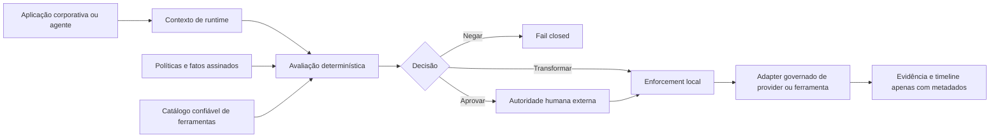

# RegulaAI — Control Plane para IA Regulada

[](https://github.com/brunovicco/regulated-ai-control-plane/actions/workflows/quality.yml)
[](https://github.com/brunovicco/regulated-ai-control-plane/releases)
[](https://www.python.org/)
[](LICENSE)

> Governe dados, escolha de providers e autoridade sobre ferramentas antes que uma operação de IA atravesse uma fronteira de confiança.

[English](README.md) · [Documentação](docs/README.md) · [Demo guiada](docs/DEMO.md) · [Release piloto](docs/PILOT_RELEASE.md)

RegulaAI é um control plane técnico para IA corporativa. Ele avalia políticas aprovadas pela
organização, aplica obrigações executáveis, restringe providers e ferramentas e registra evidências
apenas com metadados—sem pedir que um modelo decida as próprias permissões.

O foco inicial são instituições financeiras brasileiras, incluindo privacidade, transferência
internacional de dados, capacidades de providers e autoridade de agentes.

## Tour do produto


O tour mostra uma execução local real com dados sintéticos fixos e provider mock sem rede. RegulaAI
tokeniza o identificador antes da execução, chega a `ALLOW_WITH_TRANSFORMATION` / `EXECUTED` e
expõe na timeline apenas metadados, contexto de controles e digests.

<details>
<summary>Capturas estáticas</summary>

<p align="center">
  
  
</p>

</details>

## Por que RegulaAI

IA corporativa exige mais do que acesso a modelos. Uma requisição pode precisar responder:

- Estes dados podem sair da fronteira local de confiança?
- A configuração escolhida do provider atende aos controles obrigatórios?
- Quais campos precisam ser removidos, mascarados, tokenizados ou pseudonimizados?
- O modelo pode propor esta ferramenta, e quem pode autorizar a ação exata?
- Que evidência pode ser retida sem armazenar prompts, respostas ou dados pessoais?

RegulaAI transforma essas perguntas em decisões e etapas de enforcement determinísticas e
reproduzíveis.

## O que ele oferece

| Capacidade | Resultado |
| --- | --- |
| Avaliação determinística | `ALLOW`, `ALLOW_WITH_TRANSFORMATION`, `REQUIRE_APPROVAL` ou `DENY` |
| Enforcement local de dados | Remove, mascara, tokeniza ou pseudonimiza campos antes de I/O externo |
| Registro de capacidades | Resolve fatos revisados de provider/serviço/região e falha fechado quando requisitos estão obsoletos ou desconhecidos |
| Fronteiras de autoridade humana | Vincula aprovações aos digests exatos da decisão e da ação, com consumo único |
| Execução confiável de ferramentas | Trata tool calls como propostas, valida argumentos e schemas fechados e vincula uma operação mutável de sandbox não produtiva |
| Tratamento seguro de resultados | Minimiza outputs não confiáveis e nunca persiste conteúdo bruto ou seguro do resultado |
| Evidência operacional | Armazena IDs versionados, reason codes, estados e digests—não conteúdo sensível |
| Governança de releases | Verifica control packs assinados, analisa impacto, autoriza promoção e preserva custódia |

## Como funciona



RegulaAI opera acima dos providers e sistemas corporativos e abaixo das aplicações ou agentes.
Política e autoridade permanecem fora do modelo. O runtime padrão não usa rede; integrações reais
precisam ser selecionadas e configuradas explicitamente.

## Experimente localmente

Requisitos: Python 3.13+ e [`uv`](https://docs.astral.sh/uv/).

```bash
uv sync --frozen --all-groups --extra observability
uv run uvicorn regulated_ai.entrypoints.api:app --host 127.0.0.1 --port 8000
```

Em outro terminal:

```bash
curl http://127.0.0.1:8000/health
curl http://127.0.0.1:8000/v1/providers
```

Continue pela [demo sintética guiada](docs/DEMO.md) para avaliar uma operação financeira, aplicar
transformações locais, inspecionar evidências sem conteúdo sensível e explorar a timeline do
operador. A demo padrão não chama providers nem sistemas corporativos e não exige credenciais cloud.

## Superfície de runtime

| Endpoint | Finalidade |
| --- | --- |
| `POST /v1/evaluations` | Avaliar política e retornar decisão determinística e obrigações |
| `POST /v1/enforcements` | Aplicar controles locais e cruzar a fronteira do provider quando autorizado |
| `GET /v1/evidence/{evidence_id}` | Consultar evidência da decisão apenas com metadados |
| `GET /v1/enforcements/{id}` | Consultar estado e recibos do enforcement |
| `POST /v1/enforcements/{id}/tool-actions` | Validar e executar uma ação exata com aprovação separada |
| `GET /v1/tool-actions/{id}` | Consultar estado e digests da ação sem conteúdo sensível |
| `POST /v1/tool-actions/{id}/reconciliation` | Registrar resultado terminal autenticado sem reexecução |
| `GET /v1/operator/enforcements/{id}/timeline` | Inspecionar o ciclo de controles de um enforcement |
| `GET /operator?enforcement_id={id}` | Abrir a visão server-rendered para um ID exato |
| `GET /v1/providers` | Inspecionar o control pack verificado e metadados de capacidades |
| `GET /health` | Verificar a saúde do serviço |

Consulte o [contrato da API](docs/API_CONTRACT.md) para schemas, transições de estado e regras de
privacidade.

## Modelo de confiança

O desenho parte de regras inegociáveis:

1. Regulações não executam código; objetivos revisados viram políticas da organização.
2. Um modelo nunca concede autoridade a si mesmo.
3. Alegações de providers só viram capacidades após revisão curada e versionada.
4. Controles obrigatórios falham fechado quando a evidência está ausente, obsoleta ou inválida.
5. Fallback de provider não pode enfraquecer a decisão original.
6. Input sensível nunca vira payload de evidência ou observabilidade.
7. Decisões materiais são reproduzíveis a partir de inputs versionados e digests criptográficos.

Leia o [threat model](docs/THREAT_MODEL.md), o [modelo de privacidade](docs/PRIVACY.md) e a
[arquitetura](docs/ARCHITECTURE.md) para as definições completas das fronteiras.

## Piloto controlado

O release atual é [`v0.1.0rc1`](https://github.com/brunovicco/regulated-ai-control-plane/releases/tag/v0.1.0rc1),
um piloto delimitado e não produtivo.

Suportado:

- single-tenant, uma réplica e banco SQLite dedicado para evidências;
- execução mock sem rede por padrão;
- uma composição de provider com dados sintéticos por um workload de gateway revisado;
- um conector corporativo read-only vinculado a identidade e sandbox;
- somente dados sintéticos, sistemas sandbox e secrets gerenciados externamente.

Não suportado:

- tráfego produtivo ou dados pessoais de produção;
- múltiplas réplicas ou persistência distribuída;
- isolamento SaaS de tenants ou busca global do operador;
- conectores corporativos que alteram estado;
- OIDC/RBAC de produto ou alegação de certificação regulatória.

O [perfil do release piloto](docs/PILOT_RELEASE.md) define verificação, aceite e limites de rollout.

O código-fonte atual também inclui a próxima fundação produtiva: persistência PostgreSQL,
migrations versionadas, claims concorrentes seguros para múltiplas réplicas e autoridade
operacional Ed25519 com escopo por função. Isso não amplia o escopo do piloto publicado até
existirem evidências operacionais de TLS, rotação do trust store, backup/restore, SLO e aceite sob
responsabilidade do deployment.

## Mapa do repositório

```text
src/regulated_ai/
├── domain/        # políticas, decisões, obrigações e tipos de evidência
├── application/   # avaliação, enforcement, autoridade e releases
├── adapters/      # YAML, SQLite/PostgreSQL, assinaturas, gateway, ferramentas e observabilidade
├── entrypoints/   # FastAPI, UI do operador, logging e comando do piloto
└── resources/     # control pack de demonstração assinado

docs/              # produto, arquitetura, segurança e operação
examples/          # políticas, fatos, cenários e ferramentas sintéticas
governance/        # evidências de controles técnicos e gestão de riscos
deploy/            # referências não aplicadas para Kubernetes/OpenShift
tests/             # cobertura unitária, contratual e ponta a ponta
```

## Documentação

Use o [hub de documentação](docs/README.md) para escolher uma trilha de avaliação do produto,
arquitetura, segurança, integração ou operação. Registros cronológicos de engenharia ficam
separados no [roadmap](docs/MVP_ROADMAP.md), [plano de implementação](docs/IMPLEMENTATION_PLAN.md),
[ADRs](docs/adr/) e [changelog](CHANGELOG.md).

## Desenvolvimento

```bash
uv lock --check
uv sync --frozen --all-groups
uv run ruff check .
uv run ruff format --check .
uv run mypy src tests
uv run pytest
uv run python scripts/quality_gate.py
```

O contrato de engenharia está em [AGENTS.md](AGENTS.md). Vulnerabilidades devem seguir o processo
privado descrito em [SECURITY.md](SECURITY.md).

## Limite jurídico

RegulaAI é uma referência de engenharia e uma implementação de control plane. Não fornece
aconselhamento jurídico, certificação regulatória ou garantia de conformidade. Mapeamentos
regulatórios e de frameworks descrevem como controles técnicos podem apoiar objetivos aprovados
pela organização; aplicabilidade e interpretação pertencem aos stakeholders qualificados.

Distribuído sob a [Licença MIT](LICENSE).
