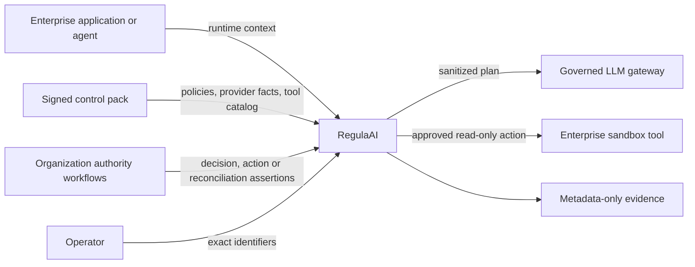

# Architecture

RegulaAI is an enforcement point between enterprise applications or agents and external AI or tool
boundaries. It makes deterministic decisions from organization-approved inputs, applies required
controls before external I/O, and records evidence without retaining sensitive content.

This document describes the system as it exists today. Historical sequencing and decision context
belong in the [roadmap](MVP_ROADMAP.md), [implementation plan](IMPLEMENTATION_PLAN.md) and
[ADRs](adr/).

## System context



RegulaAI does not interpret law at runtime. Qualified stakeholders review regulatory and internal
requirements, map them to control objectives, and approve the technical policies that the runtime
evaluates.

## Architectural planes

### Runtime enforcement plane

The runtime path is responsible for:

- validating and normalizing an operation context;
- classifying explicitly supplied data fields;
- resolving signed policies, provider capabilities and tool definitions;
- producing a deterministic decision and obligations;
- applying local transformations before provider execution;
- verifying external authority before controlled effects;
- validating and minimizing untrusted tool results;
- persisting only allowlisted evidence and lifecycle metadata.

The default provider and tool adapters are network-silent mocks. Live adapters are opt-in and
fixed-scope: one governed-gateway integration and one identity-bound, read-only sandbox connector.

### Governance and release plane

Offline workflows govern what the runtime may trust:

- Ed25519-signed control packs bind policy, provider registry and tool catalog bytes;
- semantic diff and fixed-clock scenario replay expose candidate impact;
- signed review attestations bind accountable roles to exact reviewed artifacts;
- promotion authorization requires a distinct role/key quorum;
- trust-store lifecycle, lineage, rollout and runtime-state evidence detect stale or unauthorized
  verification material;
- content-addressed custody and OCI layouts preserve metadata-only release evidence;
- provider-neutral and RFC 3161 verifiers bind trusted time evidence to exact artifact bytes.

These workflows produce evidence and authorization artifacts. They do not modify production
systems, retrieve legal sources, hold private keys or claim compliance.

### Operator plane

The operator API and server-rendered view reconstruct one enforcement timeline from an exact ID.
They expose decisions, control identifiers, reason codes, lifecycle state, provider provenance and
attention codes. They do not provide global discovery, raw request content or administrative
mutation.

## Clean architecture

```text
entrypoints ──────> application ──────> domain
     │                    ▲
     └────> adapters ─────┘
```

### Domain

`src/regulated_ai/domain/` owns framework-independent types and invariants:

- operation context, provider targets and data classifications;
- decisions, obligations and deterministic digests;
- evidence, enforcement and tool-action lifecycle states;
- trusted tool definitions, proposals and safe-result schemas;
- approval and reconciliation receipts;
- provider capability snapshots and operator timeline models.

The domain has no dependency on FastAPI, SQLite, HTTP clients, cryptography SDKs or YAML.

### Application

`src/regulated_ai/application/` coordinates use cases through typed ports:

- evaluate policy and record evidence;
- apply transformations and enforce a provider execution plan;
- validate, approve, claim and execute exact tool actions;
- reconcile ambiguous outcomes without reexecution;
- assemble operator timelines;
- compare, replay, review and authorize control-pack releases;
- verify trust-store rollout and runtime state.

Application code depends on domain contracts, never concrete infrastructure.

### Adapters

`src/regulated_ai/adapters/` translates external formats and infrastructure into application ports:

- strict YAML loaders for policies, provider capabilities, tools and trust stores;
- SQLite repositories and atomic lifecycle transitions;
- HMAC approval/reconciliation verification and Ed25519 release verification;
- governed-gateway and bounded read-only HTTP execution;
- release review, custody, OCI and trusted-time verification;
- structured logs, CloudEvents and optional OpenTelemetry export.

All untrusted input is parsed at the boundary. External calls use explicit timeouts and only bounded
retry behavior owned by the downstream integration.

### Entrypoints

`src/regulated_ai/entrypoints/` contains:

- the FastAPI composition root and HTTP contract;
- the exact-ID operator dashboard;
- structured logging and observability setup;
- the fixed-synthetic live composition command.

Entrypoints validate transport concerns and translate failures; policy and lifecycle rules remain in
the application/domain layers.

## Runtime flow

### Evaluation and provider execution

```text
request
  -> validate identifiers and bounded values
  -> classify declared fields
  -> resolve trusted tools and provider facts
  -> match deterministic policies
  -> produce decision and obligations
  -> persist metadata-only evidence
  -> apply local transformations
  -> verify decision approval when required
  -> atomically claim dispatch
  -> mock execution or governed gateway
  -> persist terminal metadata
```

Transformations occur before the execution port receives a plan. Evidence contains labels,
identifiers, versions, reason codes and digests, never field values. Gateway output is intentionally
discarded in the controlled pilot.

### Tool authority and result handling

```text
model proposal
  -> retain trusted tool identity and arguments digest only
  -> caller resubmits exact arguments and workload identity
  -> validate closed input schema and proposal binding
  -> compute action digest
  -> verify separate action approval
  -> atomically claim dispatch and consume authority
  -> mock or fixed read-only sandbox adapter
  -> validate closed output schema
  -> mask, drop or allow fields by catalog rule
  -> return safe result once; persist metadata only
```

A decision approval cannot authorize a tool action. A tool proposal cannot authorize itself. Raw
arguments, idempotency keys, assertions and tool results are ephemeral.

Timeouts or ambiguous transport failures enter `RECONCILIATION_REQUIRED`. An organization-owned
investigation can then issue a separately authenticated assertion for `EXECUTED` or
`NOT_EXECUTED`. Reconciliation records the terminal fact and never calls the tool adapter.

### Release trust

```text
candidate control pack
  -> exact-byte review
  -> signature verification
  -> semantic diff and scenario replay
  -> complete release evidence bundle
  -> signed promotion quorum
  -> content-addressed custody
  -> optional trusted timestamp and OCI transport
```

The runtime starts only from a control pack that passes digest, path, composition, signature and
trust-store checks. The same authenticated bytes feed runtime parsing and offline review.

## Trust boundaries

| Boundary | Data allowed to cross | Authority rule |
| --- | --- | --- |
| Application → RegulaAI | Explicit runtime context and ephemeral field values | Input is untrusted and schema-validated |
| RegulaAI → provider gateway | Sanitized in-memory execution plan | Policy must allow execution; configuration fixes target/provider |
| Model → tool proposal | Tool name plus ephemeral arguments | Proposal carries no execution authority |
| RegulaAI → enterprise sandbox | One validated, approved `cards.read` request | Exact action digest, workload identity and one-time authority required |
| Operator → reconciliation | Signed terminal outcome assertion | Separate domain/key and exact action binding required |
| Runtime → evidence/telemetry | Allowlisted metadata and digests | Content, credentials and tool results are prohibited |
| Release workflow → runtime | Signed public control material | Private keys remain outside the repository and runtime |

## Persistence and consistency

SQLite is the local and controlled-pilot persistence implementation. PostgreSQL is the production
adapter selected through `REGULAAI_DATABASE_URL` and managed by explicit Alembic migrations. Both
store only evaluation evidence, enforcement state, authority consumption, tool-action lifecycle,
reconciliation receipts and append-only history.

PostgreSQL conditional updates provide single-winner dispatch claims across replicas. Decision and
action approval consumption is committed in the same transaction as the corresponding claim;
reconciliation consumption is committed with its irreversible terminal action transition. Database
triggers append lifecycle history in each state transaction. Production startup checks the exact
schema revision and never performs opportunistic DDL.

The tagged controlled pilot remains one replica with a dedicated SQLite database. The production
reference runs two replicas only after the explicit migration job and deployment-owned database
controls succeed.

## Failure model

RegulaAI fails closed when:

- signed control material is missing, malformed, stale or unauthorized;
- a required provider capability is unknown or unsatisfied;
- fallback would weaken the original decision;
- approval is invalid, expired, replayed or bound to different bytes;
- proposal arguments or tool output violate their closed schemas;
- persistence cannot record a required state transition;
- a downstream result is ambiguous and cannot safely be retried.

Observability failures do not change business decisions. Logs, traces and CloudEvents remain
metadata-only and are best-effort outputs.

## Deployment profile

The repository includes restricted Kubernetes and OpenShift references with a non-root user,
read-only root filesystem, dropped capabilities, bounded resources, health probes and default-deny
egress. The manifests intentionally use a non-routable image and are never applied by repository
commands.

Cluster identity, ingress/TLS, secret injection, storage, backups, registry authentication and
approved egress remain deployment-owned. See [Kubernetes deployment](KUBERNETES_DEPLOYMENT.md) and
the [controlled pilot profile](PILOT_RELEASE.md).

## Detailed decisions

The [ADR directory](adr/) preserves the context and consequences of material choices. Start with:

- [control plane vs enforcement plane](adr/0001-control-plane-enforcement-plane.md);
- [reviewed control objectives](adr/0002-regulation-control-objective-policy.md);
- [metadata-only evidence](adr/0003-metadata-only-evidence.md);
- [local enforcement before execution](adr/0005-local-enforcement-before-execution.md);
- [trusted tool proposal boundary](adr/0008-trusted-tool-catalog-and-proposal-boundary.md);
- [action-bound tool execution](adr/0009-action-digest-bound-tool-execution.md);
- [signed control packs](adr/0016-signed-policy-provider-packs.md);
- [read-only enterprise sandbox connector](adr/0037-bound-read-only-enterprise-sandbox-connector.md);
- [terminal reconciliation](adr/0038-authenticated-terminal-tool-reconciliation.md).
