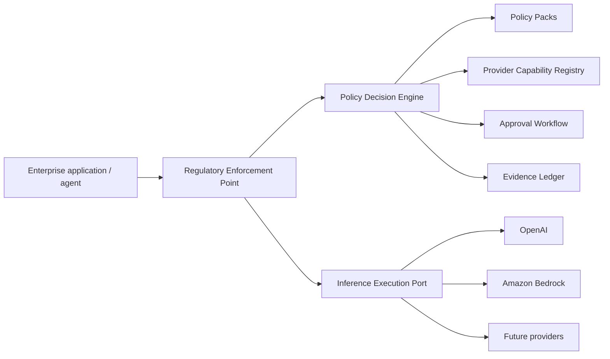
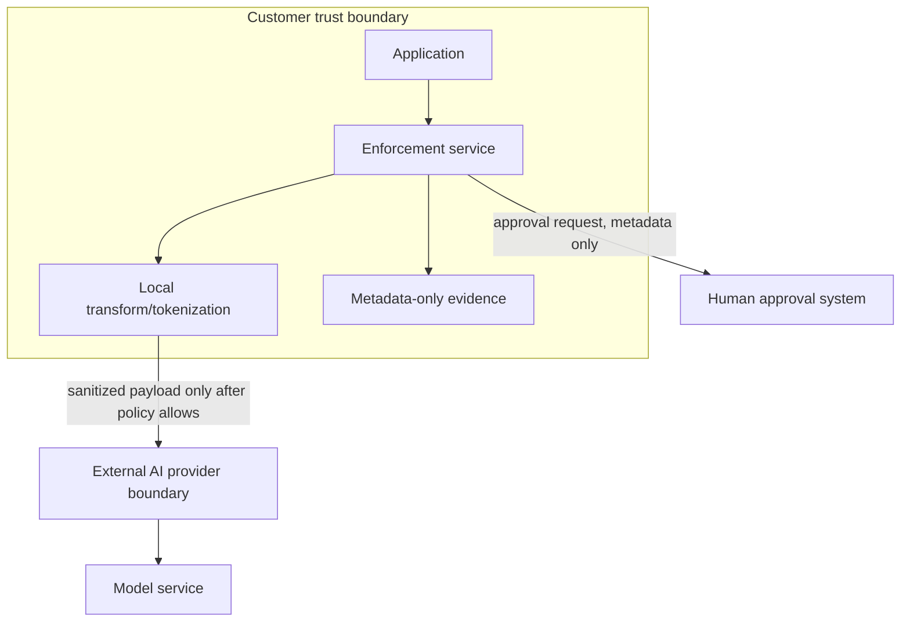
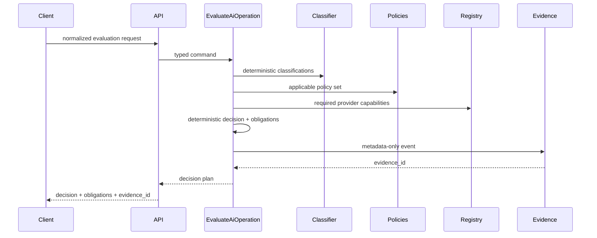

# Product architecture

## Context



Phase 1 stops before `GW`: it evaluates and returns an execution plan.

## Control plane vs enforcement plane

### Control plane

Owns versioned knowledge/configuration:
- approved control objectives;
- policies;
- provider capability registry;
- regulatory support mappings;
- freshness rules;
- policy-set releases.

It does not receive production customer prompts in the target architecture.

### Enforcement plane

Runs in or near the customer trust boundary:
- accepts normalized runtime context;
- performs deterministic identifier classification;
- evaluates policy;
- computes transformations/authority obligations;
- writes metadata-only evidence;
- later invokes the execution port.

Target deployment should support running the enforcement plane in the customer's cloud/VPC/Kubernetes
environment.

## Trust boundaries



## Clean architecture mapping

Suggested modules; adjust to the generated harness rather than fighting it.

```text
src/regulated_ai/
  domain/
    classifications.py
    capabilities.py
    controls.py
    decisions.py
    evidence.py
    policies.py
    value_objects.py

  application/
    evaluate_operation.py
    ports.py
    services.py

  adapters/
    policy_yaml/
    capability_yaml/
    evidence_sqlite/
    classifier_deterministic/
    observability/

  entrypoints/
    api/
```

### Domain

Framework-free. No FastAPI/Pydantic transport models/YAML/SQL/provider SDK imports.

### Application

Coordinates use cases and defines infrastructure ports.

Potential ports:
- `PolicyRepository`
- `ProviderCapabilityRepository`
- `EvidenceRepository`
- `DataClassifier`
- future `ApprovalPort`
- future `InferenceExecutionPort`

### Adapters

Translate external formats into application/domain types.

### Entrypoints

HTTP validation and response mapping only.

## Evaluation flow



## Future execution integration

Execution is intentionally a later slice.

The application should expose a future `InferenceExecutionPort` so the product can:
- integrate with `governed-llm-gateway`;
- call a direct provider adapter;
- call a hyperscaler adapter;
- keep provider fallback constrained by the same decision plan.

Do not copy gateway functionality into this repository.

## Failure model

Fail closed when:
- policy data required for the operation cannot be loaded/validated;
- mandatory capability is `unknown` or `unsupported`;
- high-assurance capability evidence exceeds configured freshness;
- a required transformation fails;
- an approval is required but not granted;
- policy-set/provider-registry versions cannot be resolved.

Operational/health endpoints may remain available while policy evaluation is unavailable.
